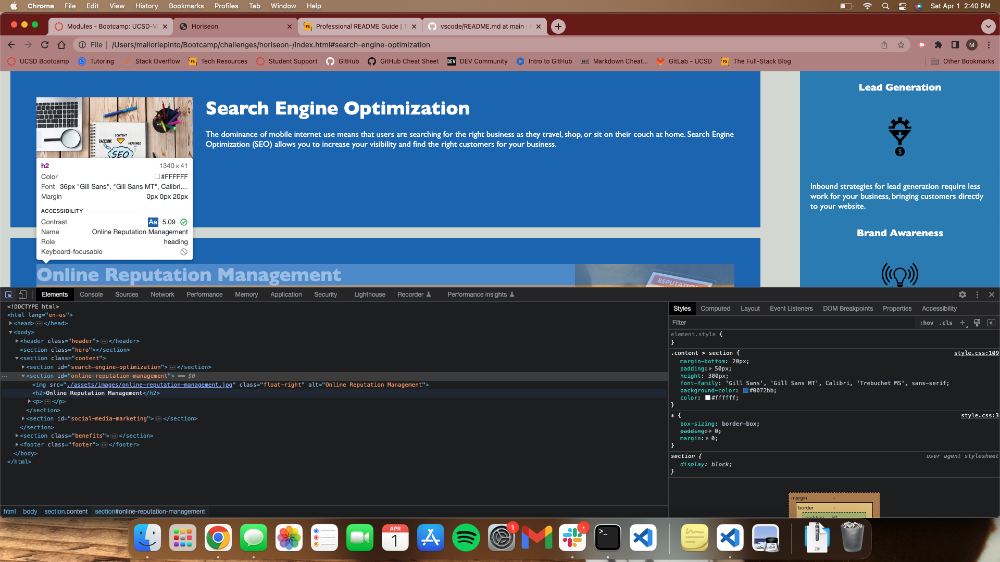

# Horiseon - Feature Request

## Description
 Feature Request Challenge 
 During this challenge a few things were accomplished to imporve the Horiseon Homepage. I have imporved the accebility of the page by adding alt attributes to each image. The order of the heading attributes, HTML elemnts and the structure on the CSS is more efficent and reads logically. I have also added a title element that compliments the Horiseon webpage. This should improve the overall score of the site and meet the accesibility standards. I imporved on the skills that were touched on in class this week; HTML structure, CSS layout and properties.  

## Installation

To visit the site use link, 
Once there you can open the ChromeDev Tools by right clicking on the page and selecting "inspect" to see the the HTML and CSS layouts.  

## Usage

You can see the accesibility rating in the screenshot below while in ChromeDev Tools.  

    
    
## License

No license